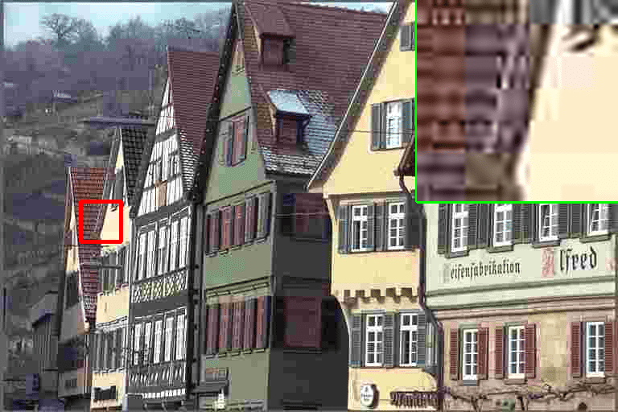
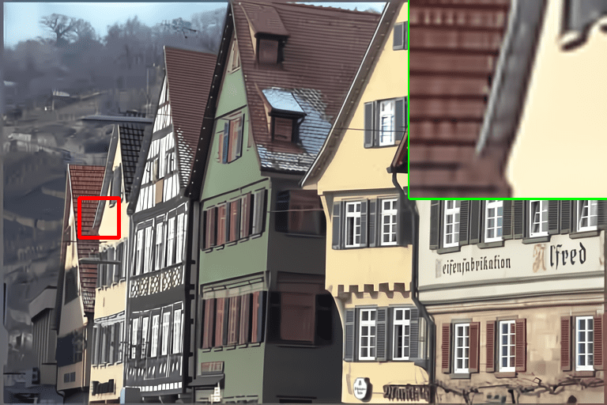

# X-Do Resolution

## X-Do Resolution based on [Swin: SwinV2 Transformer for Compressed Image Super-Resolution and Restoration](https://arxiv.org/abs/2209.11345)

<br>

[Xaindex.ai](https://xaindex.ai)

> TLDR: Photorealistic super-resolution of compressed images using transformers / neural networks.

------------------

This is the official repository and PyTorch implementation of X-Do Resolution. We provide the supplementary material, code, pretrained models and demos. Our model achieves state-of-the-art performance in:

- classical, lighweight and real-world image super-resolution (SR)
- color JPEG compression artifact reduction

> Compression plays an important role on the efficient transmission and storage of images and videos through band-limited systems such as streaming services, virtual reality or videogames. However, compression unavoidably leads to artifacts and the loss of the original information, which may severely degrade the visual quality. For these reasons, quality enhancement of compressed images has become a popular research topic. While most state-of-the-art image restoration methods are based on convolutional neural networks, other transformers-based methods such as X-Do Resolution, show impressive performance on these tasks.

---------------------------------------------------

## Training

The training code is at [KAIR](https://github.com/cszn/KAIR/).
More details about the training setup in [paper](https://arxiv.org/abs/2209.11345).

------

## Results

We achieved state-of-the-art performance on classical, lightweight and real-world image Super-Resolution (SR), JPEG compression artifact reduction, and compressed input super-resolution. We use mainly the DIV2K Dataset and Flickr2K datasets for training, and for testing:  RealSRSet, 5images/Classic5/Set5, Set14, BSD100, Urban100 and Manga109  

More details in [paper](https://arxiv.org/abs/2209.11345).

<br>

|Compressed inputs |                                  X2SR output                                  |
|       :---       |:-----------------------------------------------------------------------------:|
|  |            |
|  |           |
|  |  |


### Basic inference setup


1. create a folder `inputs` and put there the input images. The model expects low-quality and low-resolution JPEG compressed images.

2. select `--scale` standard is 4, this means we will increase the resolution of the image x4 times. For example for a 1MP image (1000x1000) we will upscale it to near 4K (4000x4000).

3. we process the images in `inputs/` and the outputs are stored in `results/x2sr_{TASK}_x{SCALE}` where TASK and SCALE are the selected options. You can just navigate through `results/`


```
python main_test_x2sr.py --task compressed_sr --scale 4 --training_patch_size 48 --model_path model_zoo/x2sr/X2SR_CompressedSR_X4_48.pth  --folder_lq ./inputs --save_img_only
```

to **reproduce results**, calculate metrics and further evaluation, please check the following section [Testing](#testing).

------

## Testing

The **original evaluation datasets** can be downloaded from the following [Kaggle Dataset](https://www.kaggle.com/datasets/jesucristo/super-resolution-benchmarks)

 

**grayscale/color JPEG compression artifact reduction**
Classic5 +LIVE1 - [download here](https://github.com/cszn/DnCNN/tree/master/testsets)

<br>


### ClassicalSR 
```
python main_test_x2sr.py --task classical_sr --scale 2 --training_patch_size 64 --model_path model_zoo/x2sr/X2SR_ClassicalSR_X2_64.pth --folder_lq testsets/Set5/LR_bicubic/X2 --folder_gt testsets/Set5/HR

python main_test_x2sr.py --task classical_sr --scale 4 --training_patch_size 64 --model_path model_zoo/x2sr/X2SR_ClassicalSR_X4_64.pth --folder_lq testsets/Set5/LR_bicubic/X4 --folder_gt testsets/Set5/HR
```

### Lightweight
```
python main_test_x2sr.py --task lightweight_sr --scale 2 --training_patch_size 64 --model_path model_zoo/x2sr/X2SR_Lightweight_X2_64.pth --folder_lq testsets/Set5/LR_bicubic/X2 --folder_gt testsets/Set5/HR
```

### RealSR
```
python main_test_x2sr.py --task real_sr --scale 4 --model_path model_zoo/x2sr/X2SR_RealworldSR_X4_64_BSRGAN_PSNR.pth --folder_lq testsets/RealSRSet+5images
```

### CompressedSR
```
python main_test_x2sr.py --task compressed_sr --scale 4 --training_patch_size 48 --model_path model_zoo/x2sr/X2SR_CompressedSR_X4_48.pth --folder_gt path/to/DIV2K_Valid_HR --folder_lq /path/to/DIV2K_Valid_LR/Compressed_X4
```

### JPEG Compression Artifact Reduction, Dynamic, GrayScale
```
python main_test_x2sr.py --task jpeg_car --jpeg 10 --model_path model_zoo/x2sr/X2SR_Jpeg_dynamic.pth --folder_gt /path/to/classic5
python main_test_x2sr.py --task jpeg_car --jpeg 20 --model_path model_zoo/x2sr/X2SR_Jpeg_dynamic.pth --folder_gt /path/to/classic5
python main_test_x2sr.py --task jpeg_car --jpeg 30 --model_path model_zoo/x2sr/X2SR_Jpeg_dynamic.pth --folder_gt /path/to/classic5
python main_test_x2sr.py --task jpeg_car --jpeg 40 --model_path model_zoo/x2sr/X2SR_Jpeg_dynamic.pth --folder_gt /path/to/classic5
```
